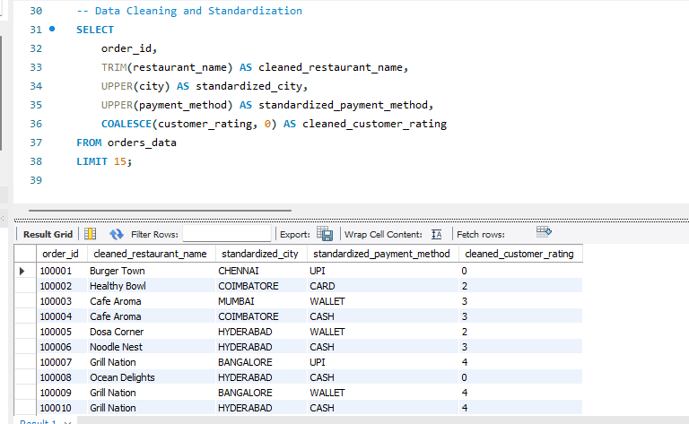
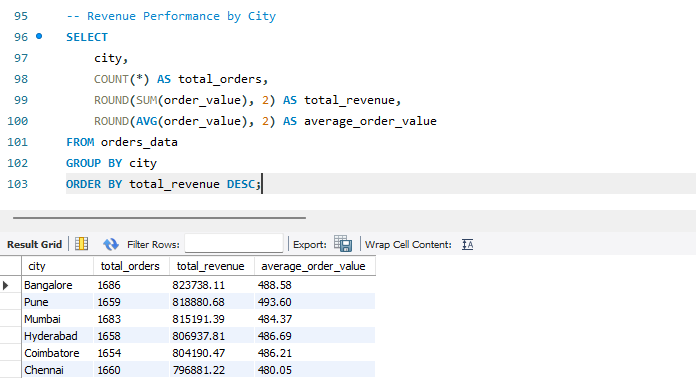
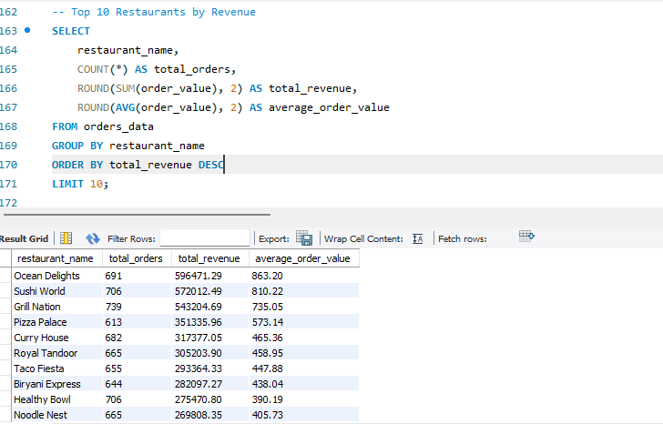
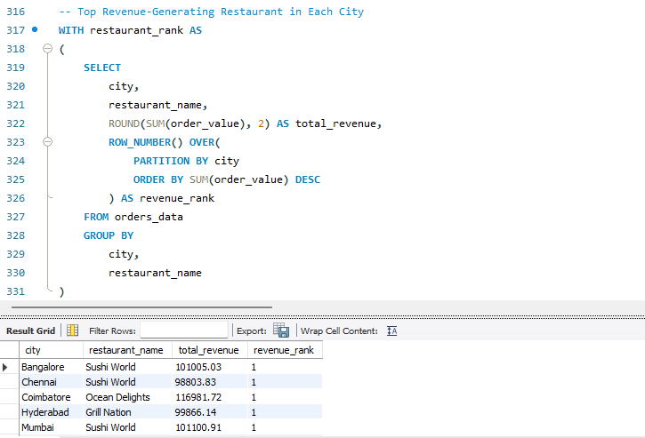
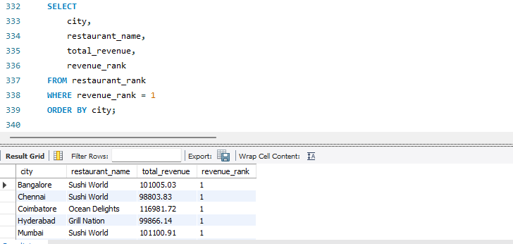

# 🍔 Food Delivery SQL Analysis

## 📌 Project Overview

This project presents an end-to-end SQL data analysis of a food delivery dataset containing 10,000 order records.

The analysis was performed using MySQL to understand order performance, revenue, customers, restaurants, cuisines, payment methods, and delivery operations.

The project follows a structured SQL workflow:

1. Data Quality Check
2. Data Cleaning
3. Exploratory Data Analysis
4. Business Questions
5. Advanced SQL Analysis

The goal is to transform raw transactional data into meaningful business insights that can support decision-making for a food delivery business.

---

## 🎯 Business Objectives

The analysis focuses on answering important business questions related to:

- Overall order and revenue performance
- Customer activity and spending
- Restaurant performance
- City-wise revenue
- Cuisine performance
- Payment method usage
- Delivery performance
- Customer ratings
- Revenue trends
- Customer ranking
- Restaurant ranking
- Order-level comparisons
- Advanced SQL analysis using CTEs and window functions

---

## 📊 Dataset Overview

The dataset is provided as a MySQL SQL script rather than a CSV file.

The SQL script contains:

- Database creation
- Table creation
- Table structure
- 10,000 transactional records
- `INSERT INTO` statements

### Dataset Columns

| Column | Description |
|---|---|
| `order_id` | Unique order identifier |
| `customer_id` | Customer identifier |
| `restaurant_name` | Restaurant name |
| `city` | Customer/order city |
| `cuisine` | Cuisine category |
| `order_date` | Date of the order |
| `delivery_time_minutes` | Delivery time in minutes |
| `order_value` | Total order value |
| `payment_method` | Payment method used |
| `delivery_status` | Delivery status |
| `customer_rating` | Customer rating |
| `delivery_partner` | Delivery partner |

---

## 📈 Dataset Summary

| Metric | Value |
|---|---:|
| Total Orders | 10,000 |
| Unique Order IDs | 10,000 |
| Unique Customers | 2,893 |
| Unique Restaurants | 15 |
| Unique Cities | 6 |
| Total Revenue | 4,865,819.68 |
| Average Order Value | 486.58 |
| Average Delivery Time | 46.43 minutes |
| Delivered Orders | 6,737 |
| Delayed Orders | 1,601 |
| Cancelled Orders | 1,662 |
| First Order Date | 2024-01-01 |
| Last Order Date | 2025-12-30 |

---

## 🛠️ Tools & Technologies

- MySQL
- MySQL Workbench
- SQL
- Common Table Expressions (CTEs)
- Window Functions
- Aggregate Functions
- Conditional Logic
- Data Cleaning
- Data Transformation

---

# 🔍 Project Workflow

## 01 — Data Quality Check

The first stage focused on validating the dataset before performing further analysis.

### Checks Performed

- Total row count
- Unique order IDs
- Unique customers
- Unique restaurants
- Unique cities
- Minimum and maximum order dates
- Missing customer ratings
- Delivery status distribution
- Data consistency checks

### Key Finding

The dataset contains **1,662 NULL customer ratings**.

All 1,662 NULL customer ratings belong to cancelled orders.

| Delivery Status | Total Orders | NULL Ratings |
|---|---:|---:|
| Delivered | 6,737 | 0 |
| Delayed | 1,601 | 0 |
| Cancelled | 1,662 | 1,662 |

This indicates that missing customer ratings are associated with cancelled orders and are logically explainable.

### Screenshot


---

## 02 — Data Cleaning

The second stage focused on identifying and handling potential data-quality issues before analysis.

### Cleaning Techniques Used

- `TRIM()`
- `UPPER()`
- `COALESCE()`
- `IS NULL`
- `IS NOT NULL`
- Conditional logic
- Text standardization
- Missing-value handling


### Example Transformation

```sql
TRIM(restaurant_name)
```

The cleaning stage helps ensure that the data is consistent and reliable for further analysis.

### Screenshot



---

## 03 — Exploratory Data Analysis

The exploratory analysis stage was used to understand the overall characteristics of the food delivery business.

### Analysis Performed

- Revenue analysis
- Order analysis
- Customer analysis
- Restaurant analysis
- Cuisine analysis
- City analysis
- Payment method analysis
- Delivery status analysis
- Customer rating analysis
- Delivery time analysis

### Screenshot



---

## 04 — Business Questions

The analysis was then used to answer practical business questions.

### Key Business Questions

- Which city generates the highest revenue?
- Which restaurant generates the highest revenue?
- Which cuisine generates the highest revenue?
- Which payment method is used most frequently?
- What is the overall revenue?
- What is the average order value?
- How many customers are present?
- How are orders distributed by delivery status?
- What is the average delivery time?
- Which customers generate the highest revenue?

### Key Insights

| Business Metric | Result |
|---|---:|
| Top Revenue City | Bangalore |
| Top Revenue City Revenue | 823,738.11 |
| Top Revenue Restaurant | Ocean Delights |
| Top Restaurant Revenue | 596,471.29 |
| Top Revenue Cuisine | North Indian |
| Top Cuisine Revenue | 622,580.95 |
| Most Used Payment Method | Card |
| Card Transactions | 2,536 |

### Executive Summary

| Metric | Value |
|---|---:|
| Total Orders | 10,000 |
| Total Revenue | 4,865,819.68 |
| Average Order Value | 486.58 |
| Unique Customers | 2,893 |
| Unique Restaurants | 15 |
| Unique Cities | 6 |
| Average Delivery Time | 46.43 minutes |
| Delivered Orders | 6,737 |
| Delayed Orders | 1,601 |
| Cancelled Orders | 1,662 |

### Screenshot



---

## 05 — Advanced SQL Analysis

The final stage focused on applying advanced SQL concepts to solve analytical problems.

### Advanced SQL Concepts Used

- Common Table Expressions (CTEs)
- `RANK()`
- `DENSE_RANK()`
- `ROW_NUMBER()`
- `LAG()`
- `LEAD()`
- `FIRST_VALUE()`
- `LAST_VALUE()`
- `PARTITION BY`
- `ORDER BY`
- Window Functions
- Running Totals
- Customer Ranking
- Restaurant Ranking
- Order Comparisons

### Examples of Advanced Analysis

**Customer Ranking**

Customers were ranked based on their total spending.

**Restaurant Ranking**

Restaurants were ranked within each city based on revenue.

**Previous Order Comparison**

`LAG()` was used to compare each order with the previous order.

**Next Order Comparison**

`LEAD()` was used to compare each order with the next order.

**Highest and Lowest Orders**

`FIRST_VALUE()` and `LAST_VALUE()` were used to identify the highest and lowest order values within each city.

### Advanced SQL Screenshots

**SQL Code**



**SQL Result**



---

## 📁 Project Structure

```text
food-delivery-sql-analysis/
│
├── dataset/
│   └── food_delivery_data.sql
│
├── screenshots/
│   ├── 01_data_quality.png
│   ├── 02_data_cleaning.png
│   ├── 03_exploratory_analysis.png
│   ├── 04_business_questions.png
│   ├── 05_advanced_sql_code.png
│   └── 05_advanced_sql_result.png
│
├── sql/
│   ├── 01_data_quality_check.sql
│   ├── 02_data_cleaning.sql
│   ├── 03_exploratory_analysis.sql
│   ├── 04_business_questions.sql
│   └── 05_advanced_sql.sql
│
└── README.md
```

---

## ▶️ How to Run the Project

### 1. Install MySQL

Install MySQL Server and MySQL Workbench.

### 2. Load the Dataset

Open the SQL dataset file located in the `dataset` folder.

Run the SQL script in MySQL Workbench.

The script creates the `food_delivery_portfolio` database, creates the `orders_data` table, and inserts the transactional records.

### 3. Select the Database

```sql
USE food_delivery_portfolio;
```

### 4. Run the Analysis

Execute the SQL scripts in the following order:

1. `01_data_quality_check.sql`
2. `02_data_cleaning.sql`
3. `03_exploratory_analysis.sql`
4. `04_business_questions.sql`
5. `05_advanced_sql.sql`

---

## 💡 Key Business Insights

The analysis produced several useful business insights:

- The dataset contains **10,000 orders**.
- Total revenue generated is approximately **4.87 million**.
- **Bangalore** is the highest-revenue city.
- **Ocean Delights** is the highest-revenue restaurant.
- **North Indian** is the highest-revenue cuisine.
- **Card** is the most frequently used payment method.
- **6,737 orders** were delivered successfully.
- **1,601 orders** were delayed.
- **1,662 orders** were cancelled.
- The average delivery time is approximately **46 minutes**.
- All missing customer ratings are associated with cancelled orders.

---

## 🧠 Skills Demonstrated

This project demonstrates practical experience in:

- SQL Data Analysis
- Data Quality Validation
- Data Cleaning
- Exploratory Data Analysis
- Business Analysis
- Revenue Analysis
- Customer Analysis
- Restaurant Analysis
- Window Functions
- CTEs
- Ranking Functions
- Conditional Logic
- Aggregation
- MySQL Workbench
- Translating business questions into SQL queries

---

## 🎯 Conclusion

This project demonstrates an end-to-end SQL analysis workflow using a food delivery transactional dataset.

The analysis moves from data quality validation and cleaning to exploratory analysis, business-focused questions, and advanced SQL techniques.

The project demonstrates how SQL can be used to transform raw transactional data into meaningful business insights related to customers, restaurants, revenue, cities, cuisines, payments, and delivery performance.

---

## 📌 Project Information

| Item | Details |
|---|---|
| Database | MySQL |
| Environment | MySQL Workbench |
| Dataset | Food Delivery Transactions |
| Records | 10,000 |
| Analysis Type | SQL-Based Business Analytics |
