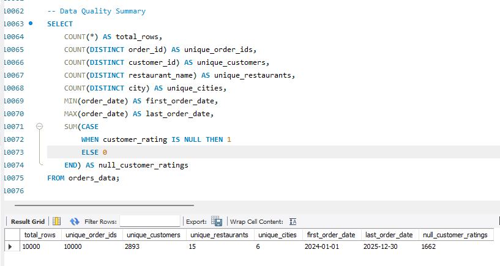

# 🍔 Food Delivery SQL Analysis

## 📌 Project Overview

This project analyzes a 10,000-record food delivery dataset using MySQL to identify revenue, customer, restaurant, cuisine, payment, and delivery performance insights.

The project follows an end-to-end SQL data analysis workflow, starting with data quality validation and cleaning, followed by exploratory analysis, business analysis, and advanced SQL techniques.

The goal is to transform raw transactional data into meaningful business insights that can support decision-making for a food delivery business.

---

## 🎯 Business Objective

The analysis focuses on answering important business questions related to:

- Overall order and revenue performance
- Customer and restaurant activity
- Revenue performance across cities
- Restaurant and cuisine performance
- Payment method usage
- Delivery performance
- Customer spending behavior
- Revenue trends
- Restaurant and customer ranking
- Order-level comparisons

---

## 📊 Dataset Overview

| Metric | Value |
|---|---:|
| Total Orders | 10,000 |
| Unique Order IDs | 10,000 |
| Unique Customers | 2,893 |
| Unique Restaurants | 15 |
| Unique Cities | 6 |
| Total Revenue | 4,865,819.68 |
| Average Order Value | 486.58 |
| Average Delivery Time | 46.43 minutes |
| Delivered Orders | 6,737 |
| Delayed Orders | 1,601 |
| Cancelled Orders | 1,662 |
| First Order Date | 2024-01-01 |
| Last Order Date | 2025-12-30 |

---

## 🛠️ Tools & Technologies

- MySQL
- MySQL Workbench
- SQL
- Common Table Expressions (CTEs)
- Window Functions
- Aggregate Functions
- Conditional Logic
- Data Cleaning & Transformation

---

# 🔍 Project Workflow

## 01 — Data Quality Check

The first stage focused on validating the dataset before performing analysis.

### Checks Performed

- Total row count
- Unique order IDs
- Unique customers
- Unique restaurants
- Unique cities
- Date range
- Missing customer ratings
- Delivery-status consistency

### Key Finding

There are **1,662 NULL customer ratings**, and all 1,662 belong to cancelled orders.

| Delivery Status | Orders | NULL Ratings |
|---|---:|---:|
| Delivered | 6,737 | 0 |
| Delayed | 1,601 | 0 |
| Cancelled | 1,662 | 1,662 |

This indicates that missing customer ratings are associated with cancelled orders and are therefore logically explainable.

### Screenshot



---

## 02 — Data Cleaning

The second stage focused on preparing the data for reliable analysis.

### Cleaning Techniques Used

- `TRIM()`
- `UPPER()`
- `COALESCE()`
- `IS NULL`
- `IS NOT NULL`
- Text standardization
- Missing-value handling

### Example Transformations

```sql
TRIM(restaurant_name)
UPPER(city)
COALESCE(customer_rating, 0)

03 — Exploratory Data Analysis

The exploratory analysis focused on understanding overall business performance.

Areas Analyzed
Total orders
Total revenue
Average order value
Revenue by city
Revenue by cuisine
Orders by payment method
Orders by delivery status
Restaurant performance
Overall Performance
KPI	Result
Total Orders	10,000
Total Revenue	4,865,819.68
Average Order Value	486.58
Unique Customers	2,893
Unique Restaurants	15
Unique Cities	6
Screenshot

04 — Business Questions

This stage focused on answering practical business questions using SQL.

Key Business Questions
Which restaurants generate the highest revenue?
Which customers have the highest spending?
What is the monthly revenue trend?
Which cuisine generates the highest revenue?
Which cities generate above-average revenue?
Which restaurants have the highest number of orders?
What is the average delivery time by city?
How does revenue differ between delivered and cancelled orders?
How does customer spending vary across categories?
Top Business Performers
Category	Top Performer	Result
City	Bangalore	823,738.11 revenue
Restaurant	Ocean Delights	596,471.29 revenue
Cuisine	North Indian	622,580.95 revenue
Payment Method	Card	2,536 orders
Business Interpretation

Bangalore generated the highest revenue among the analyzed cities.

Ocean Delights was the highest-revenue restaurant.

North Indian cuisine generated the highest cuisine-level revenue.

Card was the most frequently used payment method, with 2,536 orders.

Screenshot

05 — Advanced SQL Analysis

The final stage demonstrates advanced SQL techniques commonly used by Data Analysts.

Advanced SQL Concepts Used
Common Table Expressions — WITH
ROW_NUMBER()
RANK()
DENSE_RANK()
LAG()
LEAD()
FIRST_VALUE()
LAST_VALUE()
PARTITION BY
Running totals
Revenue contribution analysis
Customer ranking
Order comparison
Conditional analysis using CASE
Example Advanced Analysis

The project identifies the highest-revenue restaurant within each city using ROW_NUMBER() and PARTITION BY.

SQL Logic
ROW_NUMBER() OVER(
    PARTITION BY city
    ORDER BY SUM(order_value) DESC
)

This ranks restaurants independently within each city and identifies the top-performing restaurant.

Screenshots

📌 Key Business Insights
1. Overall Transaction Performance

The dataset contains 10,000 orders generated by 2,893 unique customers across 6 cities.

2. Revenue Performance

The business generated total revenue of approximately 4.87 million, with an average order value of 486.58.

3. Bangalore Is the Leading City

Bangalore generated 823,738.11 in revenue, making it the highest-revenue city in the dataset.

4. Ocean Delights Is the Top Restaurant

Ocean Delights generated 596,471.29, making it the highest-revenue restaurant.

5. North Indian Cuisine Leads Revenue

North Indian cuisine generated 622,580.95, making it the top-performing cuisine category.

6. Delivery Performance

Out of 10,000 orders:

6,737 were delivered
1,601 were delayed
1,662 were cancelled
7. Missing Ratings Are Associated with Cancelled Orders

All 1,662 missing customer ratings belong to cancelled orders.

8. Card Is the Leading Payment Method

Card payments accounted for 2,536 orders, making it the most frequently used payment method.

💡 Business Recommendations
📍 Focus on High-Performing Cities

Bangalore's strong revenue contribution suggests opportunities for:

Restaurant expansion
Customer acquisition
Targeted marketing
Delivery capacity optimization
🍽️ Promote High-Performing Restaurants and Cuisines

High-performing restaurants and cuisine categories could be considered for:

Promotional campaigns
Featured listings
Partnership programs
Customer loyalty offers
🚚 Investigate Delayed and Cancelled Orders

With 1,601 delayed and 1,662 cancelled orders, delivery operations represent an important area for further investigation.

Potential areas include:

Delivery partner performance
Restaurant preparation time
Peak-hour demand
Geographic delivery challenges
💳 Support Digital Payment Adoption

Card payments are the most frequently used payment method, highlighting the importance of maintaining a smooth digital payment experience.

📁 Repository Structure
food-delivery-sql-analysis/
│
├── README.md
│
├── dataset/
│   └── food_delivery_dataset.csv
│
├── sql/
│   ├── 01_data_quality_check.sql
│   ├── 02_data_cleaning.sql
│   ├── 03_exploratory_analysis.sql
│   ├── 04_business_questions.sql
│   └── 05_advanced_sql.sql
│
└── screenshots/
    ├── 01_data_quality.png
    ├── 02_data_cleaning.png
    ├── 03_exploratory_analysis.png
    ├── 04_business_questions.png
    ├── 05_advanced_sql_code.png
    └── 05_advanced_sql_result.png
🎓 Skills Demonstrated
SQL Fundamentals
SELECT
WHERE
GROUP BY
ORDER BY
HAVING
Aggregate Functions
Data Cleaning
TRIM()
UPPER()
COALESCE()
NULL Handling
Analytical SQL
Subqueries
CTEs
Conditional Aggregation
CASE WHEN
Advanced SQL
Window Functions
Ranking
LAG()
LEAD()
Running Totals
PARTITION BY
Business Analysis
Revenue Analysis
Customer Analysis
Restaurant Performance
Delivery Analysis
Payment Analysis
🚀 Conclusion

This project demonstrates an end-to-end SQL workflow for analyzing food delivery operations, from data quality validation and cleaning to exploratory analysis, business problem solving, and advanced SQL analytics.

The analysis transforms raw transactional data into actionable insights related to revenue, customers, restaurants, cities, cuisines, payments, and delivery performance.

🔗 Project Information

Database: MySQL
Environment: MySQL Workbench
Dataset: Food Delivery Transactions
Records: 10,000
Analysis: SQL-based Business Analytics
